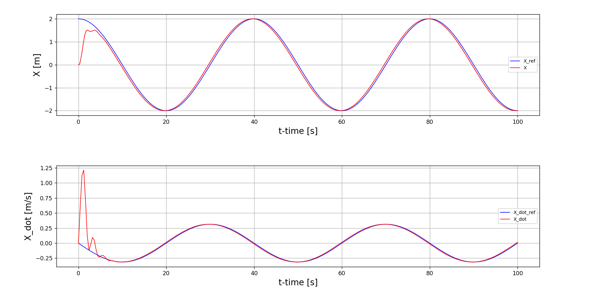
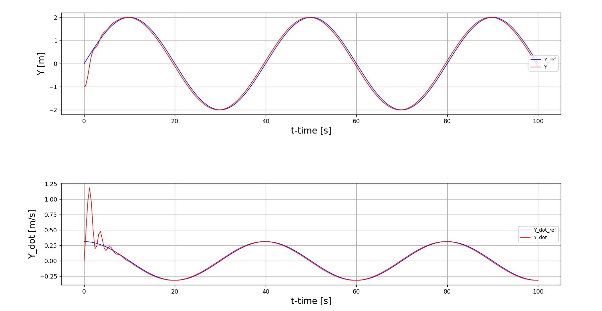
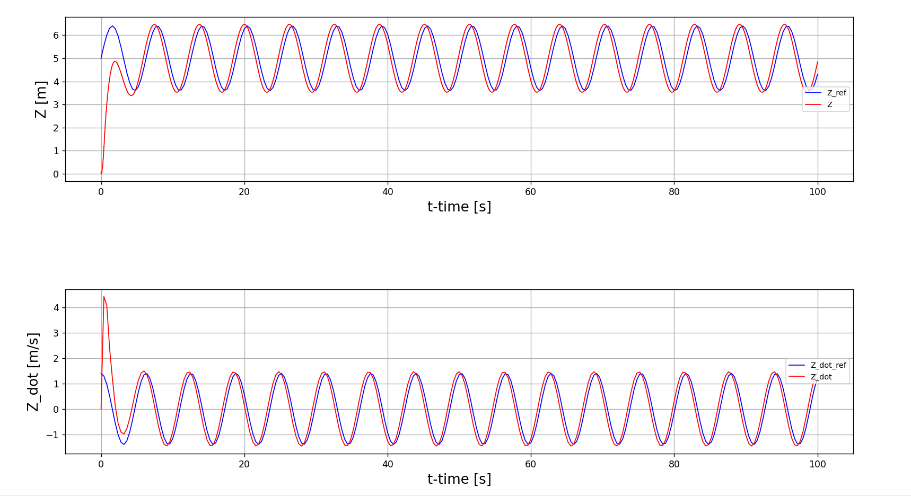
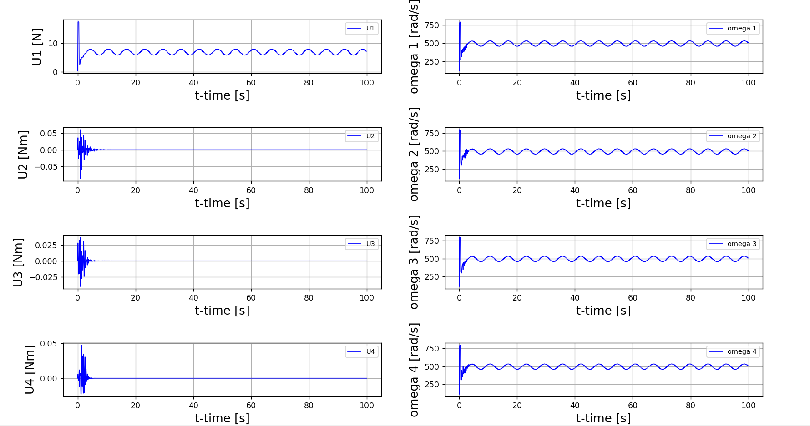
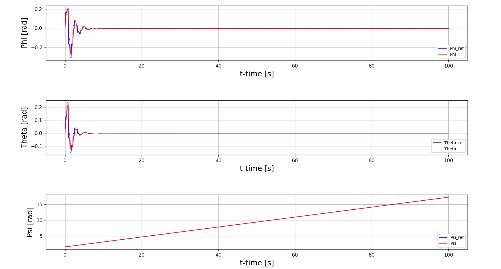
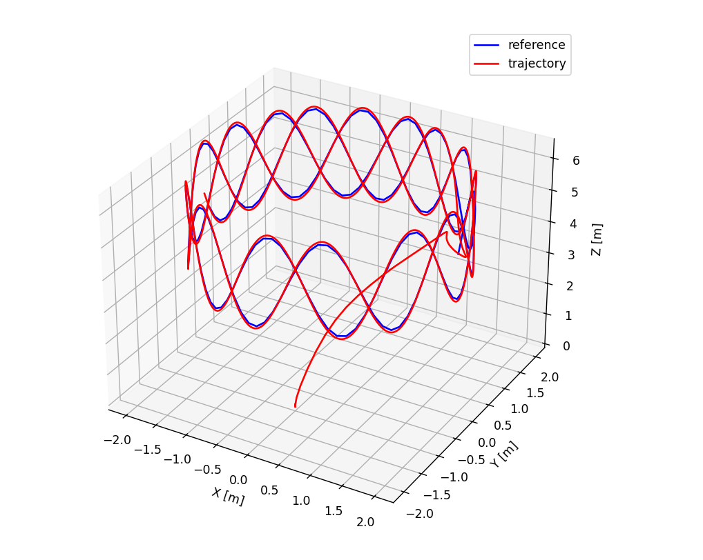

# 🚁 UAV Quadcopter Simulation using LPV-MPC & Feedback Linearization

A Python-based simulation project that demonstrates a hybrid control strategy for a quadcopter UAV. It combines **Linear Parameter Varying Model Predictive Control (LPV-MPC)** with **Feedback Linearization** to enable accurate and stable 3D trajectory tracking under nonlinear dynamics — ideal for real-world UAV applications like autonomous navigation, inspection, and rescue missions.

---

## 🎯 Objective

- Reformulate UAV dynamics into a Linear Parameter Varying (LPV) model.
- Apply LPV-MPC for attitude control (roll, pitch, yaw).
- Implement feedback linearization for positional control (x, y, z).
- Develop a modular dual-loop controller for flight stability.
- Simulate and validate performance across complex 3D trajectories.

---

## 🛠️ Tech Stack

| Component        | Tool/Library                  |
|------------------|-------------------------------|
| Language         | Python                        |
| Optimization     | `cvxpy`, `quadprog`           |
| Simulation       | `numpy`, `scipy`, `matplotlib`|
| Control Strategy | MPC, Feedback Linearization   |
| Math Model       | Newton-Euler, LPV             |

---

## 🧱 Architecture Overview

**Dual-Loop Control System:**

- **Outer Loop (Position Controller)**  
  Uses feedback linearization to compute thrust (U1) and reference roll/pitch angles.
  
- **Inner Loop (Attitude Controller)**  
  Uses LPV-MPC to track desired angles and compute control torques (U2, U3, U4).

Control flow diagram:

                    +----------------------+
                    |     Trajectory       |
                    |       Planner        |
                    +----------------------+
                               ↓
                    +----------------------+
                    | Feedback Linearization|
                    |  (Position Controller)|
                    +----------------------+
                        ↓           ↓
                   [Thrust]     [Ref Angles]
                                     ↓
                          +------------------+
                          |     LPV-MPC      |
                          | (Attitude Ctrl)  |
                          +------------------+
                                     ↓
                            → [UAV Dynamics] ←
                                 ↑ Feedback
---

## 📐 Methodology

1. **Nonlinear Modeling**:  
   - 6-DOF model derived via Newton-Euler equations.
   - Coordinate transformation between body-fixed and Earth-fixed frames.

2. **LPV Reformulation**:  
   - Converts nonlinear model into an LPV structure for linear MPC applicability.

3. **Control Strategy**:  
   - LPV-MPC minimizes trajectory error and input effort over a prediction horizon.
   - Feedback linearization computes target roll/pitch from position error.

4. **Simulation Loop**:  
   - Uses `solve_ivp` for integration and `cvxpy` for solving optimization at each time step.

---

## 📊 Results

### 🧮 Control Input & Rotor Response
- Thrust and torque inputs stabilize over time.
- Rotor speeds show consistent, balanced oscillations aligned with control output.

### 📈 Axis Tracking Performance
- **Z-axis**: Excellent sinusoidal reference tracking.
- **Y-axis/X-axis**: Minimal lag, quick transient recovery, and high trajectory fidelity.

### 🌀 Attitude Stability
- **Roll (φ)** and **Pitch (θ)** converge smoothly.
- **Yaw (ψ)** matches reference linearly and without error.

### 🛰️ 3D Trajectory Tracking
- Actual UAV path (red) closely follows the reference (blue) in spiral and circular test cases.

---

## 🖼️ Visual Outputs

  
  
  

  
  
  

---

## 📚 Learning Outcomes

- Developed an understanding of dual-loop UAV control systems combining LPV-MPC and feedback linearization.
- Gained hands-on experience in modeling nonlinear UAV dynamics using Newton-Euler equations.
- Learned how to transform nonlinear dynamics into LPV form for compatibility with linear MPC.
- Implemented and tuned Model Predictive Controllers in Python using libraries like `cvxpy`.
- Validated the control strategy through simulation of 3D reference trajectories.
- Strengthened skills in Python-based control simulation, system integration, and trajectory tracking evaluation.

---

## 🚧 Challenges Faced

- **Global LPV-MPC instability**: A single controller couldn’t manage the nonlinear behavior of all UAV states.
- **Controller decoupling**: Required separation into position and attitude controllers for stability and accuracy.
- **MPC tuning**: Fine-tuning the prediction horizon, weights, and constraints for fast convergence was challenging.
- **Simulation synchronization**: Ensuring real-time feedback between control layers and UAV plant model during numerical integration.
- **Handling trajectory complexity**: Sharp turns and nonlinear paths required a highly responsive controller to minimize deviation.

---

## 🔮 Future Enhancements

- 🧠 **Hardware implementation**: Deploy the architecture on a real quadrotor using embedded microcontrollers (e.g., Raspberry Pi, STM32).
- 🌐 **ROS integration**: Port the system to Robot Operating System (ROS) for modularity, scalability, and real-time communication.
- 🌬️ **Disturbance modeling**: Add external factors like wind, payload variations, and sensor noise for robustness testing.
- 🧭 **Path planning**: Integrate global path planners and dynamic obstacle avoidance.
- 🎮 **Simulation extensions**: Move to Gazebo or Unity for realistic physical environments and visualization.

---

## 👨‍💻 Authors

- **Aashutosh Yadav**  
- **Amarnath Tiwari**  
- **Rishi Kumar Gupta**  
- **Abhijeet Dwivedi**  

*Department of Electrical Engineering*  
Maulana Azad National Institute of Technology, Bhopal  
📬Specialization: Control Systems, UAV Dynamics, Autonomous Robotics, Python Programming, System
